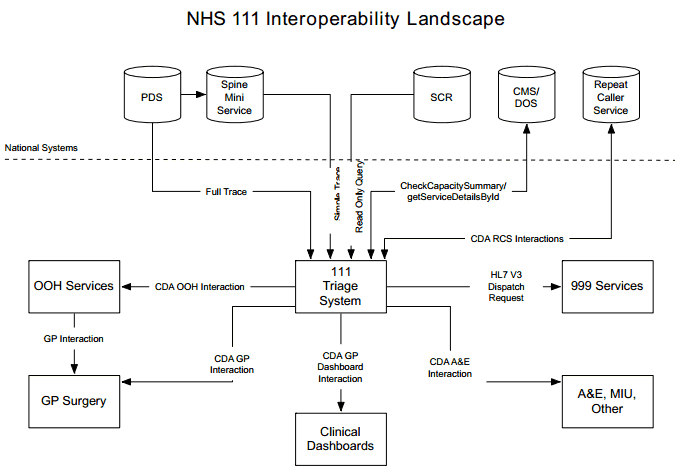

# Existing NHS 111 IM&T Standards

[TOC]

These are the existing standards which were issued as part of the initial NHS 111 rollout - these standards remain current until they are specifically superceded by new guidance.

- [Messaging Requirements](messaging_requirements.md)
- [Non-functional Requirements](nonfunc_requirements.md)
- [Post Event Messaging Requirements](post-event-messaging.md)

## Introduction

### Purpose

The purpose of this document is to provide an interoperability specification to be used for the
exchange of pathways information for transfer of care between the 111 service providers.

### Scope

The scope of this document is to lay down the foundations for specific message interactions
between the 111 system suppliers.

## Solution Overview

his section provides a summary view to allow readers a familiarisation with the key aspects
which will aid in the understanding of the document contents.

The solution covers the mechanism for the transfer of triage information between the NHS
111 call handling organisations as well as to the various health service providers including
ambulance trusts, Out Of Hours (OOH) services and the Repeat Caller Service.

The overall NHS 111 solution allows the call handler to direct for different forms of medical
care and to make this available at the most relevant point of care for the patient based on the
results of triage. This can be in the form of an ambulance dispatch, referring to OOH / urgent
care services or simply providing medical information amongst other outcomes.

This document focuses on the technical elements of information exchange & specifies a
standard mechanism to incorporate this implementation. The solution architecture can be
seen in Figure 1.

## Messaging Requirements

Note that this section makes extensive reference to ITK Specifications. These may be
obtained from the TRUD download service, see https://www.uktcregistration.nss.cfh.nhs.uk.
(Further assistance with TRUD may be obtained from the Data Standards and Products
Helpdesk at <mailto:datastandards@nhs.net>.

The relevant TRUD packages are:

- NHS 111 Version: 1.0; Status: - RC2 Domain Message Specification under NHS
  MESSAGE SPECIFICATIONS – the 111 messaging payload specifications

- **nhs_itkcore** - the ITK core specifications, including web services transport

- **nhs_itkaccreditation** – details of the ITK accreditation process

### MSG.1 Payload specifications
Message payloads MUST be conformant with the 111 message definitions

These are specified in NHS 111 Version: 1.0; Status: - RC2 Domain Message Specification
under NHS MESSAGE SPECIFICATIONS.

### MSG.2 ITK Distribution Envelope
Messages MUST wrap the 111 message in an ITK Distribution Envelope.

Usage of the Distribution Envelope is also specified in **nhs_itkcore**.

### MSG.3 ITK Messaging Architecture
All 111 messaging implementations MUST be compliant with the ITK Messaging Architecture
specification.

The document “**NPFIT-ELIBR-AREL-DST-0433.01 ITK 2.0 Messaging Architecture v2.0**”
(see nhs_itkcore pack) provides further detail about use of the Distribution Envelope, and other generic aspects of ITK message handling (eg versioning, reliable handling). The
requirements in this document MUST be complied with.

(Note that for the purposes of initial 111 go-live then the messaging security requirements (COR-SEC-01 through COR-SEC-05) may be considered to be adequately covered by the approach based on TLS Mutual Authentication that is described in requirement **MSG.6** below).

### MSG.4 ITK Web Services Transport
All 111 messaging implementations MUST be compliant with the ITK Web Services
Transport Specification.

The document “**NPFIT-ELIBR-AREL-DST-0430.02 ITK 2.0 Web Services Transport
Specification v3.0**” (see nhs_itkcore pack) provides further detail about the ITK web
services transport. The requirements in this document MUST be complied with, with the exception of the requirements listed below which MAY be omitted for initial 111 go-live:

- The following requirements may be excepted for initial 111 go-live as they are not
  relevant as they relate to messaging patterns that are not currently needed by 111:

  - **WS-PAT-02**: Toolkit Web Services MUST use the Asynchronous Invocation style for Pattern 1 services where this is specified

  - **WS-PAT-03**: Toolkit Web Services MUST use the Synchronous Invocation Pattern for Pattern 2 services

  - **WS-PAT-04**: The SimpleMessageResponse MUST contain simple acknowledgement
     of a Pattern 2 request

- The following requirements are security related, and may be excepted for initial 111 go-
  live, as an alternative, simplified, security approach has been defined for 111 (see **MSG.6**
  below):

  - **WS-SEC-03**: Toolkit Implementations MUST sign the message timestamp

  - **WS-SEC-07**: Toolkit Implementations MUST be able to authenticate a requestor’s identity

  - **WS-SEC-08**: Toolkit Implementations MUST be able to authorise a service request, based on the Service and the Requestor’s identity

  - **WS-DSC-15**: The timestamp element of the SOAP Header MUST be signed

  - **WS-DSC-05**: Canonicalization method MUST be present in the signature

  - **WS-DSC-06**: PKI certificates MUST be used for message signing

  - **WS-DSC-17**: PKI certificates MUST be from a recognised CA

  - **WS-DSC-18**: Toolkit middleware and applications MUST preinstall all CA root certificates that are listed in the Microsoft Trusted Root Certificate Store.

  - **WS-DSC-19**: Toolkit middleware and applications MUST preinstall the NHS CA Root Certificate

  - **WS-DSC-20**: Toolkit middleware and applications MAY preinstall the Root Certificate from other CAs that they choose to trust

  - **WS-DSC-21**: Toolkit middleware and applications MUST verify the certificate Thumbprint against an approved list

  - **WS-DSC-09**: Detached signatures SHOULD be used if XML Signature is utilised

  - **WS-DSC-10**: KeyInfo element MUST use SecurityTokenReference

  - **WS-DSC-14**: The X509 certificate MUST be included in the BinarySecurityToken element

### MSG.5 Full ITK Compliance
All 111 messaging implementations SHOULD gain full “ITK Application” Accreditation, including support for the 111 messaging payload bundle.

In practice this will involve, in addition to the above, implementing the remaining requirements in the “itk_core” pack – see “**NPFIT-ELIBR-AREL-DST-0422.02 ITK 2.0 Specifications Overview v2.0**” for details of the additional ITK requirements modules that are relevant to this.

### MSG.6 Security based on TLS Mutual Authentication
The 111 service requires “any-to-any” connections between nodes: call handlers and service providers. Connections are made under the direction of information in the 111 directory of service. The size of the handler and provider population, and the requirement to be able to add handlers and providers with a minimum of disruption, argues against reliance on firewalls to restrict connection access. To use firewalls, would require significant reconfiguration across the estate each time a handler or provider is added.

An alternative is to open a single firewall port on each 111 node and rely on certificates and mutually-authenticated TLS to secure connections. This works by requiring that all 111 nodes have a certificate which is identifiable, and trustworthy as, belonging to a bona fide 111 node. On receipt, a connection will only be accepted if it is secured with a certificate that is trustworthy as being from another 111 node. Sites are configured to use this simply by installing the certificate authority certificates, in their platform. Port 1879 has been agreed as the port that will be used by all parties for 111 messaging.

Such trustworthiness is assured by the “policy” which guards the issuance of a certificate to a 111 site. At the time of initial rollout, there is no such established policy which completely assures the identity of a 111 node – delivery of that policy is dependent on a PKI project with a longer delivery timescale than NHS 111.

As an interim, Spine certificates will be used. Spine certificates are signed by a nationally-recognised Certificate Authority, and protected by a policy which identifies sites for connection to Spine. On their own, Spine certificates do not identify a site as a 111 node. However, to create a Spine certificate the Fully Qualified Domain Name (FQDN) and associated IP address of the site must be provided, and the policy enforces this. Therefore, by controlling access to an aspect of the FQDN, the 111 programme ensures that the certificate issued by Spine, identifies the holder as a 111 node.

This will be done by placing all 111 nodes under the subdomain “oneoneone.nhs.uk” – control of that subdomain provides the additional 111-specific policy around the issuance of Spine certificates, that makes a 111-specific certificate trustworthy as such.

On receipt of a connection request, an NHS 111 endpoint will only accept the connection
if it is secured by a Spine-issued certificate that has a CN containing an FQDN of the form
nodename.oneoneone.nhs.uk. In more detail these checks comprise of:

- Full certificate path validation and revocation check by both client and server (client and server stated in the context of the TLS Protocol but in essence, both parties perform verification and validation of each others presented certificates)

- Check the validity of the dates within the certificates presented

- Check that the certificate being presented is one which has been issued to a 111 node
  (i.e. has a CN containing an FQDN of the form nodename.oneoneone.nhs.uk)

- Check the issuer of the presented certificate and that should include checking of
  Authority Key ID and Subject Key ID

Note that using the FQDN to provide additional identification for a 111 endpoint is a tactical solution and MAY be subject to changes in future policy regarding DNS or use of the 111 services. For example use of the FQDN check might become redundant at such time as 111 security policy is handled via the processes that protect issuance of certificates against a specific 111 sub CA. To avoid undue impact on deployed systems, vendors MUST allow the FQDN checks to be configured such that they can be “turned off” without the need to deploy changed code.

### 4.7 MSG.7 Direct, synchronous connection
To be able to fulfil the requirements for 111 messaging the following properties of the interaction must exist:

- The interface MUST be synchronous from the perspective of an HTTPS connection. The request and response are communicated over the same HTTPS connection and the user must be conscious of the message response in real time.

- The service caller and provider MUST NOT communicate via an intermediary.

### 4.8 MSG.8 Endpoint Addressing
Messages to service providers (eg Out of Hours, Ambulance) will be addressed to the service provider’s endpoint for receiving 111 messages. This service provider endpoint MUST be as retrieved from the 111 Directory of Service (DoS). The location of the DoS itself MUST be a configurable item.

Messages to the Repeat Caller Database will be addressed to a single well-known endpoint.
The details of this Repeat Caller Database endpoint MUST be a configurable item.

## 5 Non-functional Requirements

The following requirements are expected to be implemented by all suppliers involved in the NHS 111 pilots. This list is likely to grow during the development of the NHS 111 pilot solution.

### 5.1 NFR.1 Flexible Architecture

The system SHOULD be designed flexibly, so as to accommodate change.

The systems and interfaces comprising the NHS Care Record Services will change over time, as new policies and functionality are introduced, and the operational environment evolves. This will require that suppliers are able to modify, activate and deactivate system and user interfaces, and the operational behaviour of the system, or parts thereof.

### 5.2 NFR.2 Support for Multiple Versions of Message Definitions

The system MUST be designed in such a way as to support multiple versions of message definitions as receiver and sender of NHS 111 messages to and from other suppliers/organisations.

### 5.3 NFR.3 Availability

The Availability of the system MUST be appropriate for the environment in which it is being deployed, taking into consideration its intended usage.

The method for calculating the target Availability of the system MUST be defined, and the required target Availability MUST be documented.

The actual Availability of the system MUST be monitored.

Failure to meet the required target Availability of the system must be addressed through service improvements.

### 5.4 NFR. 4 Open Standards

Suppliers SHOULD adopt Open Standards wherever possible for the development, testing and deployment of accredited systems that will connect to any of the Spine Services.

Across the NHS, Open Standards will be applied where applicable, and suppliers are likely to accommodate change most easily if they have adhered to this requirement.

### 5.5 NFR.5.001 Response Times

The system MUST enable users to work efficiently.

System design must take account of the user experience and ensure that the introduction of NHS 111 functionality enhances, rather than degrades, the user experience.

Systems should make use of appropriate current technology and best practice, and take into consideration the expected response time characteristics of using web services.

## Post Event Messaging

The actions that need to be completed by NHS 111 System Vendors to resolve these issues are:

1. All areas must have plans in place to implement ITK within the GP systems. ITK is proven to reduce the workload on GP’s, as the current practice of using DTS increases workload on NHS 111, GP’s, and increases the amount of faxing within NHS 111 service in particular for Out of Area calls  
2. GP Primary Recipient messages must contain the DoS Service ID in the distribution envelope for routing purposes and the ODS code if it is available;
3. GP Copy Recipient messages must contain the ODS code in the distribution envelope for routing purposes and the DoS Service ID if it is available;
4. GP Copy Recipient messages must not be sent when successfully referring to OOH by the urn:nhs-itk:interaction:primaryOutofHourRecipientNHS111CDADocument-v2-0 interaction, this should be determined by the DOS Service Type ID of GP Out of Hours. The current suppression of a copy message where it is the same GP as the primary message should continue to operate.
5. Item 4 must be developed as a configuration item within the application to ensure the suppression of PEM to any Service Type ID’s can be turned back on should it be required.
6. Within all CDA documents at the /ClinicalDocument/component/structuredBody/component/section/component/section element MUST contain the following items only in the order presented, using the titles (/ClinicalDocument/component/structuredBody/component/section/component/section/title) shown here, and appropriate text (/ClinicalDocument/component/structuredBody/component/section/component/section/text):
    a. Patient’s Reported Condition;
    b. Pathways Disposition (this should include selected service);  
    c. Consultation Summary;  
    d. Pathways Assessment;  
    e. Advice Given

Non ITK Transmission

In all circumstances where ITK is not used the following requirements are mandatory.

This is applicable for all transport mechanisms including email, faxing, DTS or any other mechanism that is not ITK routed or is transmitted via an intermediary HUB:

1. The CDA_NPfIT_Document_Renderer_NHS111.xsl renderer should no longer be used;
2. For primary recipient messages NHS111_CDA_Renderer_PrimaryRecipients.xsl renderer must be used;
3. For copy recipient messages NHS111_CDA_Renderer_CopyRecipients.xsl renderer must be used.

The renderers are now available to the NHS 111 system vendors via the private repository used for distribution hosted on bitbucket.org.
